# Features

A visual tour of the main `chdig` features. More detail in the sub-pages:

- [Queries.md](Queries.md) - query history views, filtering and per-query
  inspection (`EXPLAIN`, details, logs, `KILL`, ...)
- [SystemViews.md](SystemViews.md) - merges, mutations, parts, replication,
  tables, backups, dictionaries, errors
- [Actions.md](Actions.md) - full list of shortcuts and actions

All images are reproducible: [scripts/generate-load.sh](scripts/generate-load.sh)
creates a demo database with realistic activity on a local server and
[scripts/capture-screenshots.sh](scripts/capture-screenshots.sh) drives `chdig`
in tmux and renders the screenshots/recordings.

## Tour

Starts with a configured pane layout (queries + CPU flamegraph + server
logs), then filtering, `EXPLAIN`, pane zoom and swapping a pane's view (the
[asciinema recording](https://asciinema.org/a/ZEKN312JmcADLtiS) also shows
the keystrokes):

## Navigation: Ctrl-P

**Ctrl-P** is the main navigation mechanism: fuzzy search over *everything* -
all views and all actions of the focused view - so there is nothing to
memorize:

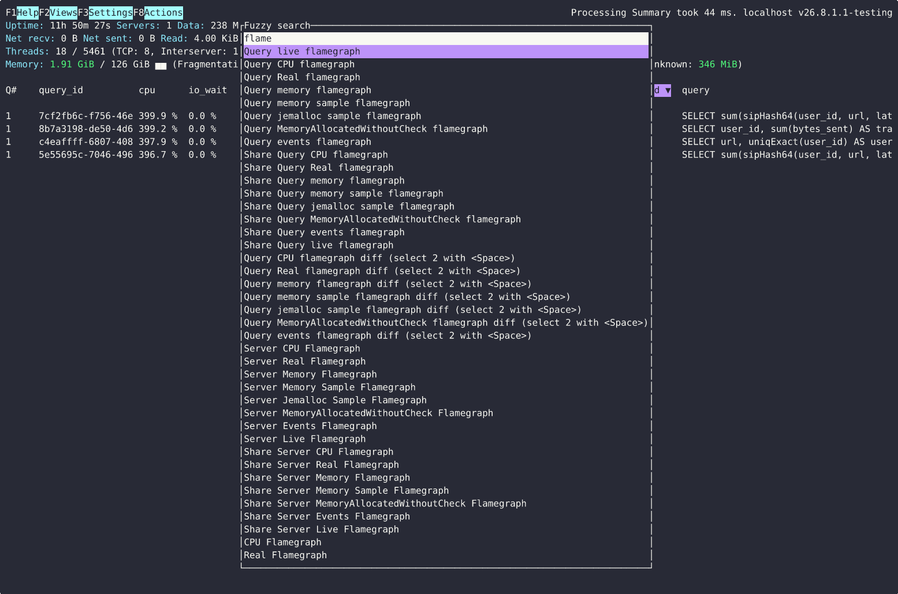

If you prefer the old school way, the same is reachable via menus: **F2**
(views), **F8** (actions of the focused view), **F1** (help with all
shortcuts), **F3** (settings):

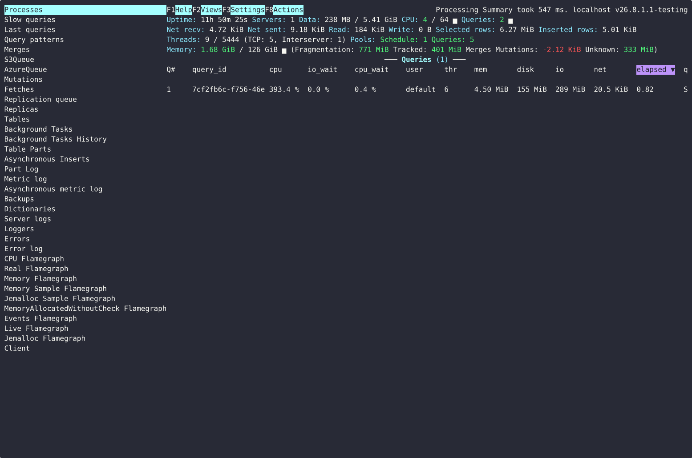 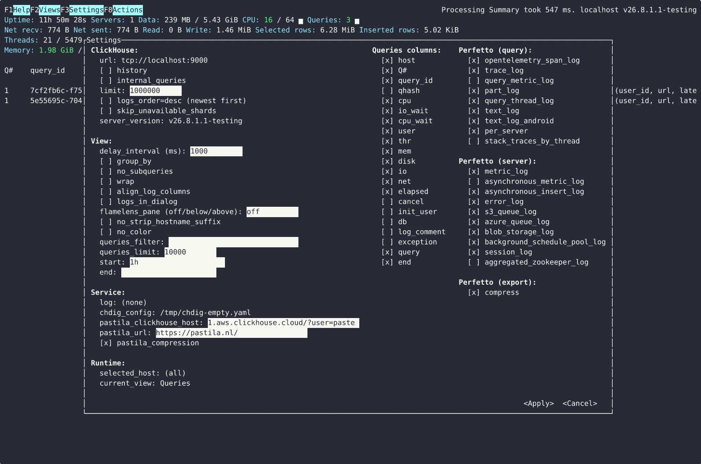

## Queries

The default view (`system.processes`): currently running queries with
per-query CPU, IO/CPU wait, memory, disk/network usage and subqueries count
(`Q#`), auto-refreshed every `--delay-interval`:

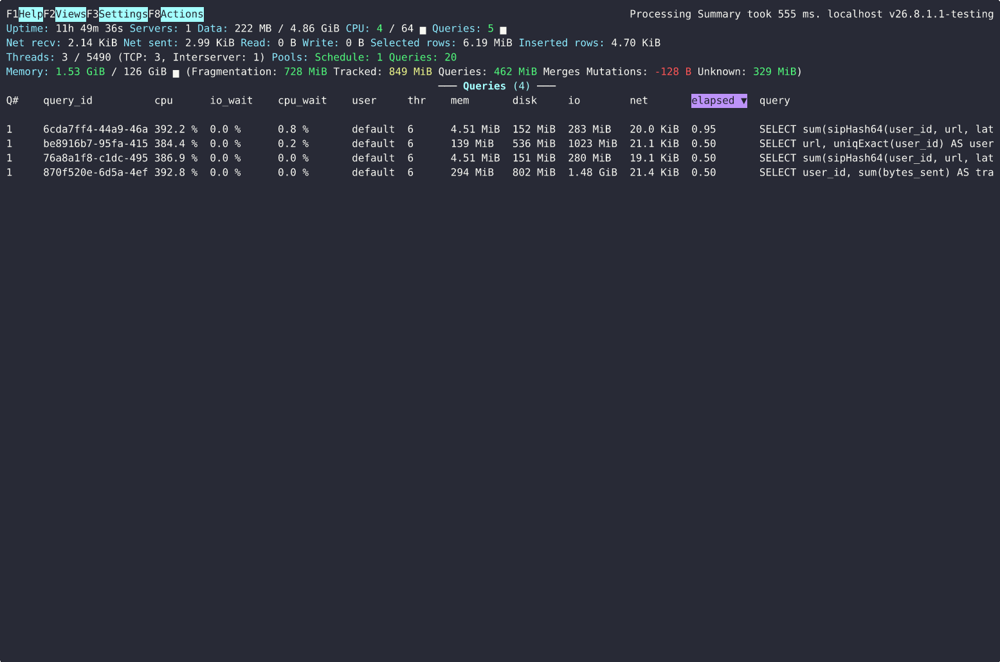

From here any query can be examined (**S** - query text, **e** - `EXPLAIN
PLAN`, ...), killed (**K**), or profiled with per-query flamegraphs - see
[Queries.md](Queries.md) for the whole set, including the `system.query_log`
views (slow/last queries).

## Query patterns

Queries grouped by `normalized_query_hash` with duration distribution - a
quick way to see what dominates the workload. The sortable metric column and
the per-pattern heatmap can be switched between ~25 metrics (duration,
CPU/IO/network time, memory, read/written/result bytes, selected
parts/ranges/marks, exceptions, threads, ...): **Space** cycles them, **m**
opens a fuzzy picker
([asciinema recording](https://asciinema.org/a/3xZbBwSZ157g2JBM)):

[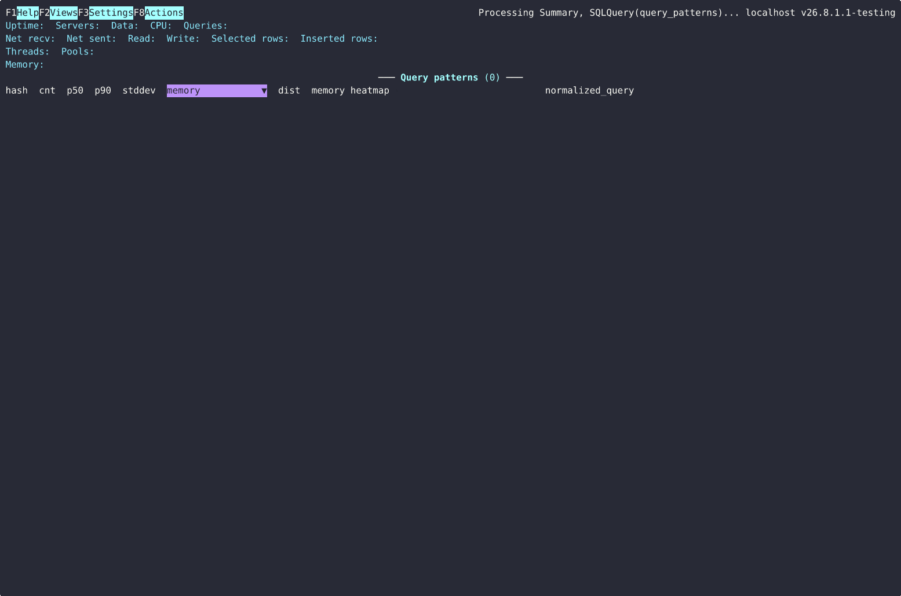](https://asciinema.org/a/3xZbBwSZ157g2JBM)

## Flamegraphs

CPU/Real/Memory/ProfileEvents flamegraphs, rendered right in the terminal via
embedded [flamelens](https://github.com/YS-L/flamelens) - for the whole server
(**F** for CPU) or for the selected query, over the current time interval
(`system.trace_log`):

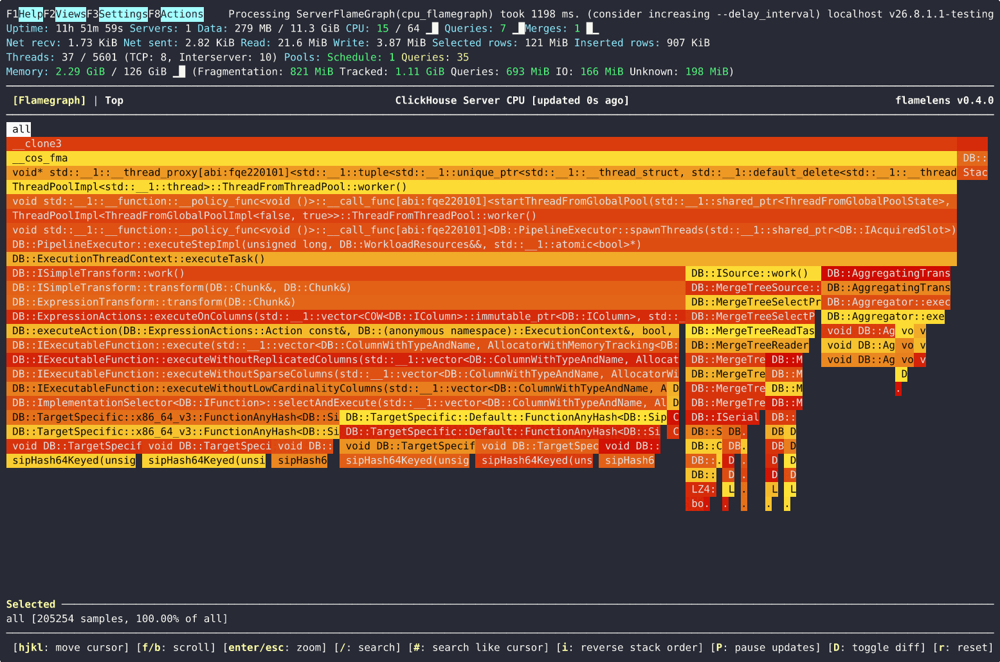

*Live* flamegraphs are built from `system.stack_trace` and auto-refresh while
the view is open (or while the query is running - **L**), so you can watch
what the server is doing right now
([asciinema recording](https://asciinema.org/a/HcfBqRAMIdtP7c7B)):

Any flamegraph can also be opened in
[speedscope](https://www.speedscope.app/) via the *Share* actions, and two
queries can be compared with the *flamegraph diff* actions (select them with
**Space**).

## Logs

**Server logs** tails `system.text_log` with level coloring, regex search
(**/**, **?**), wrap toggle and save/share; the same viewer is used for
per-query logs (**l** in query views):

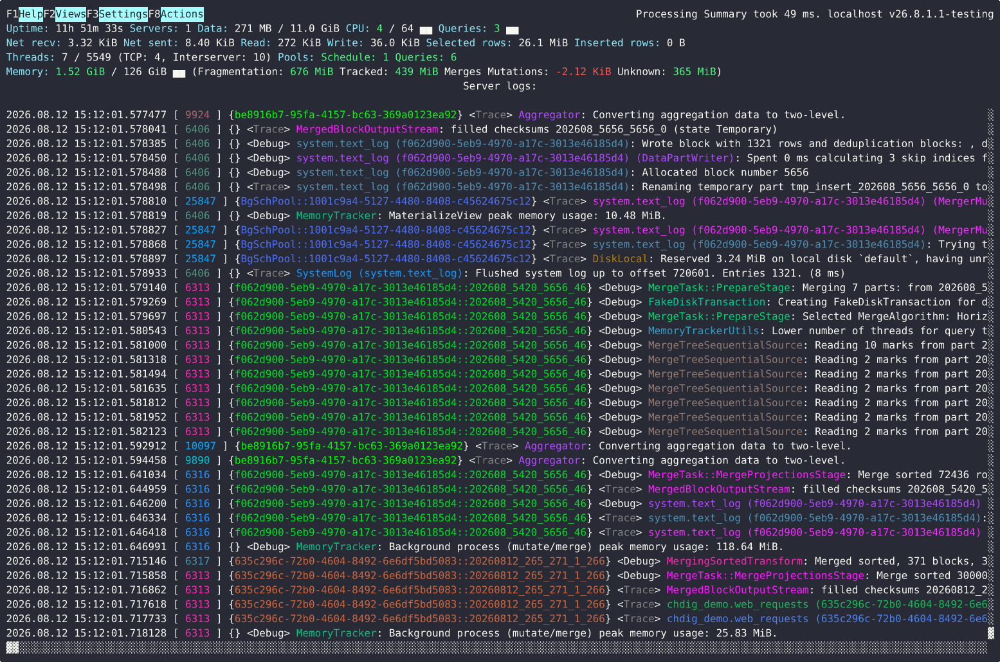

And it has smart filtering: **Ctrl-F** tags every distinct query id (`q1`),
logger (`l1`), level (`v1`) and host (`h1`) inline - type a tag to filter the
view by that value (left: filter mode, right: filtered by the `MemoryTracker`
logger). **Ctrl-S** does the same but opens a new view, fetching everything
adjacent (±1 minute) for the chosen tag from the server:

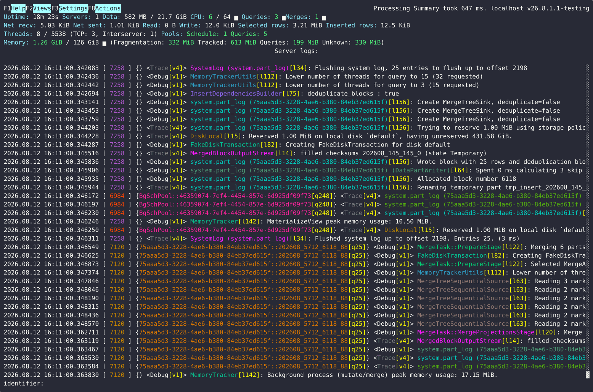 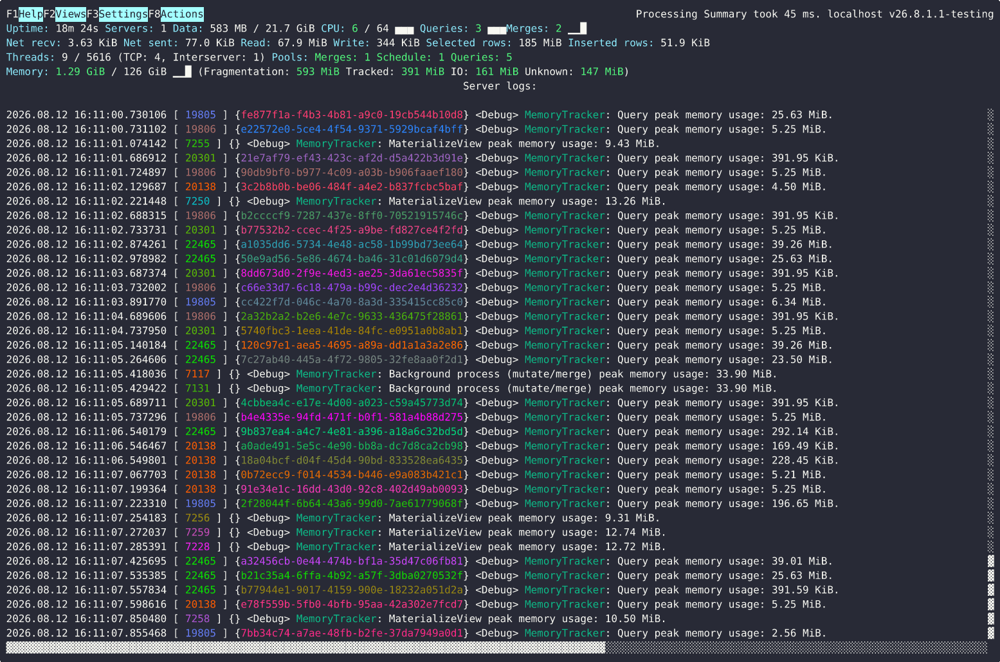

## Panes and layout

Views can be combined tmux-style: **Alt-=**/**Alt--** split the focused pane
(and open the views menu for the new one), **Alt-Arrows** move focus,
**Ctrl-Arrows** (or mouse drag) resize, **Ctrl-x** zooms, **q**/**Esc** close
the focused pane
([asciinema recording](https://asciinema.org/a/omHXu4Y2CeqFDPyr)):

[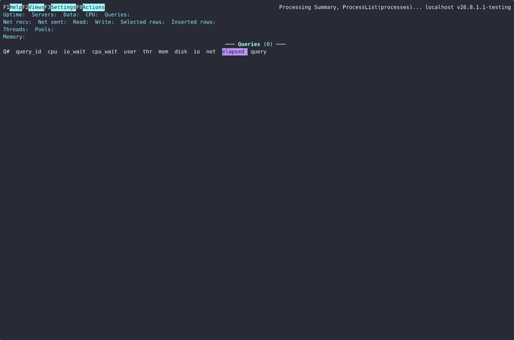](https://asciinema.org/a/omHXu4Y2CeqFDPyr)

A startup layout can be configured in the
[config file](FAQ.md#how-to-configure-views-and-panes-layout-like-tmuxinator), including
flamegraph panes:

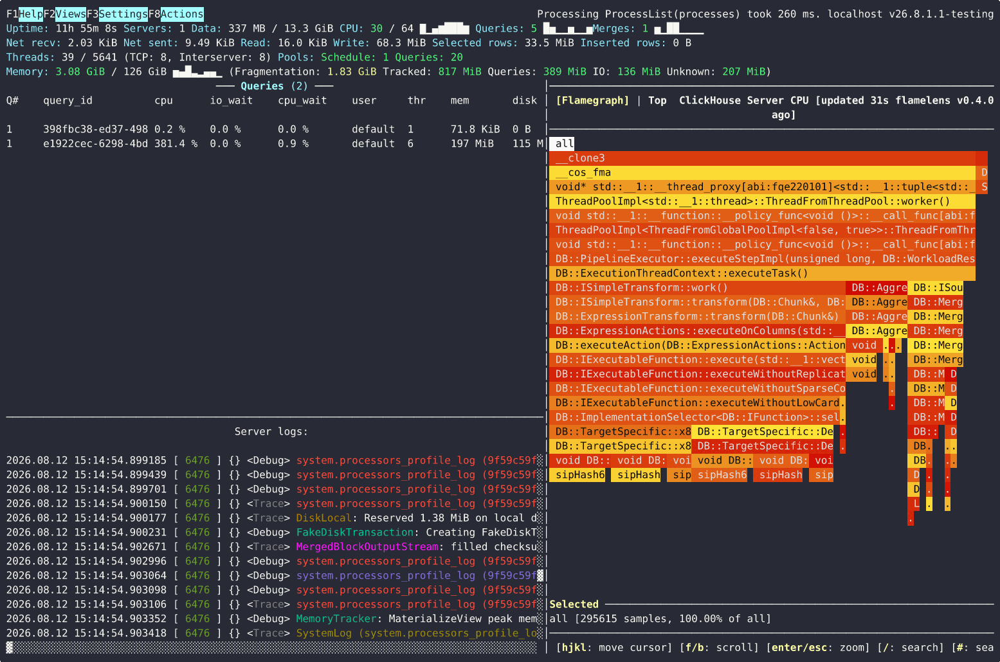

## And more

Cluster mode (`--cluster`, with per-host filtering via **Ctrl-H**), time
interval seeking (**t**/**T**/**Alt-t**), Perfetto trace export, jemalloc
profiling, an interactive SQL client (`chdig client`), and more - see
[Queries.md](Queries.md), [SystemViews.md](SystemViews.md),
[Actions.md](Actions.md) and [FAQ.md](FAQ.md).
