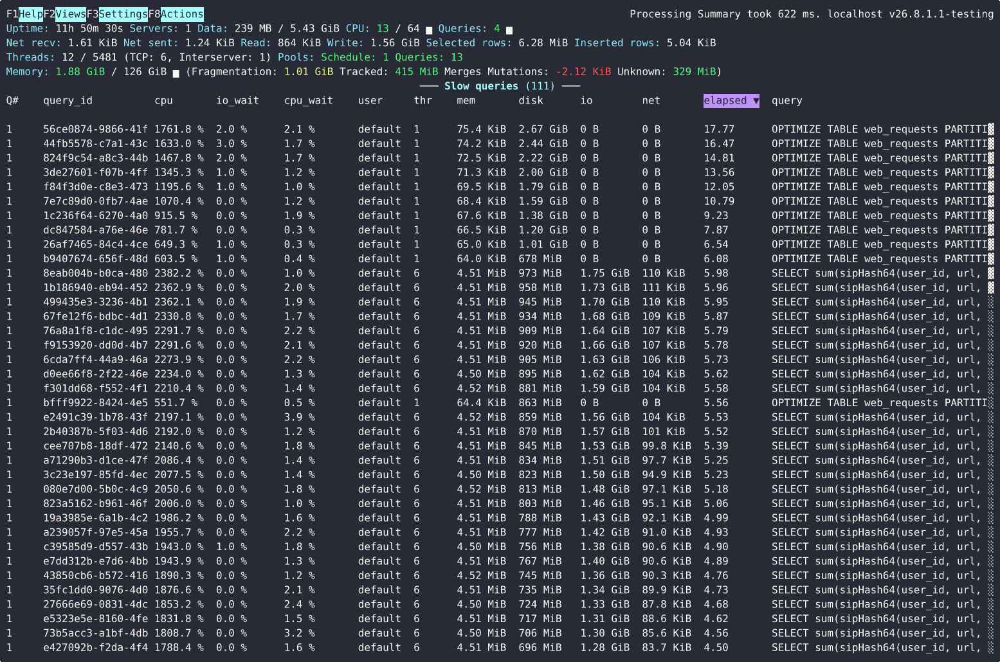
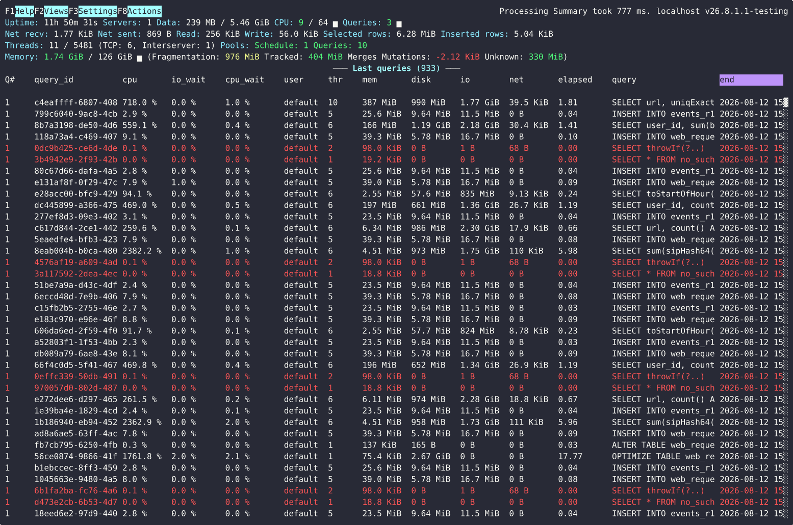
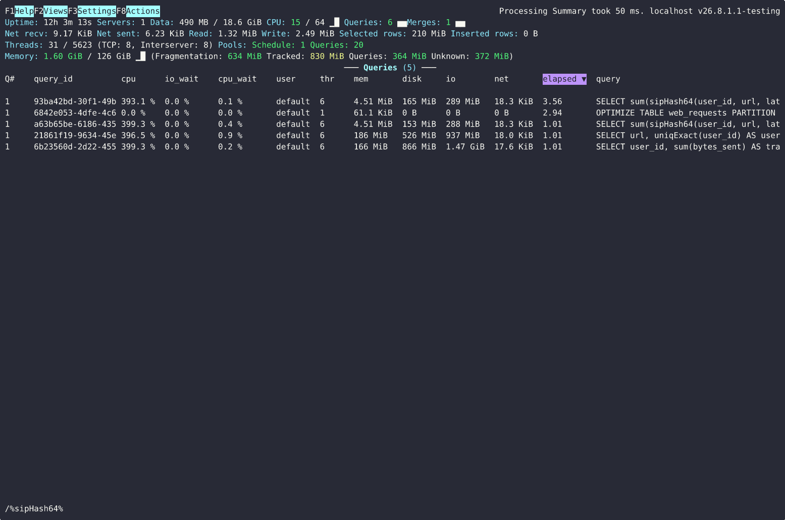
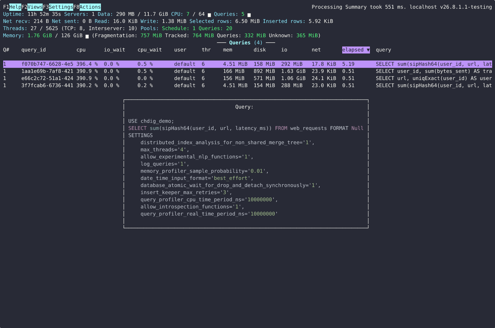
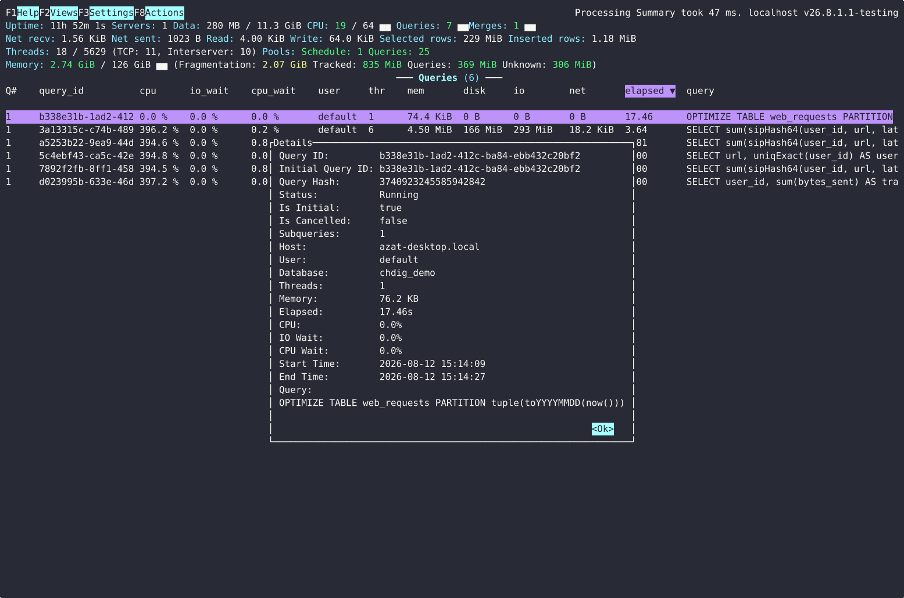
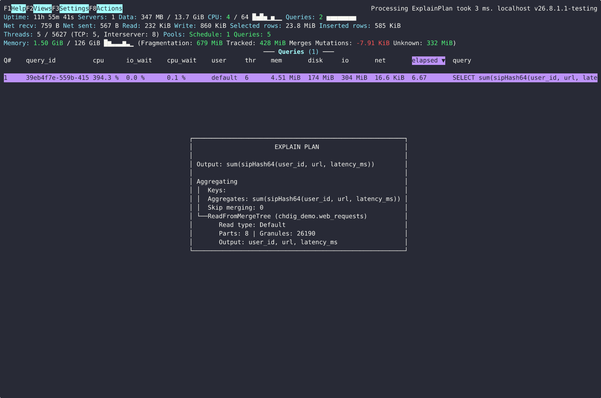

# Query views

Complements the [Queries section of the features tour](Features.md#queries).
Every view/action here is reachable via **Ctrl-P**; the shortcuts are listed
in [Actions.md](Actions.md).

## History views (`system.query_log`)

- **Slow queries** (`chdig slow-queries`) - queries slower than 1 second,
  ordered by duration:

  

- **Last queries** (`chdig last-queries`) - recently finished queries:

  

The time interval is controlled with `--start`/`--end` and can be moved
interactively (**t**/**T**/**Alt-t**).

## Filtering

**/** filters any query view with a `LIKE` pattern (matched against query,
user, query_id, ...); **-** shows everything again:

## Inspecting a query

**S** shows the full query text:

*Query details* (via **Ctrl-P**) shows everything about one query:

**e**/**E**/**s**/**I** run `EXPLAIN PLAN`/`PIPELINE`/`SYNTAX`/`INDEXES` for
the selected query (**G** opens the pipeline graph in the browser):

## Other per-query actions

- **K** - `KILL` the query
- **l** - show the query's logs (see [log filtering](Features.md#logs))
- **y** - copy the query to the clipboard
- **Alt-E** - edit the query and re-execute it
- **L** - live flamegraph of the running query; CPU/Real/Memory variants and
  *Share* (speedscope) versions via **Ctrl-P**
- *Query flamegraph diff* - select two queries with **Space** and compare
  their profiles
- *Export to Perfetto* - open the query timeline in
  [ui.perfetto.dev](https://ui.perfetto.dev/)
  (see [FAQ](FAQ.md#what-is-perfetto-export))
