# System views

The rest of the views from the [features tour](Features.md): background
operations, replication, storage and server state. All of them are reachable
via **Ctrl-P** (or **F2**) and as CLI subcommands (`chdig merges`, ...).

## Merges and mutations

`system.merges` and `system.mutations` for watching background operations
progress:

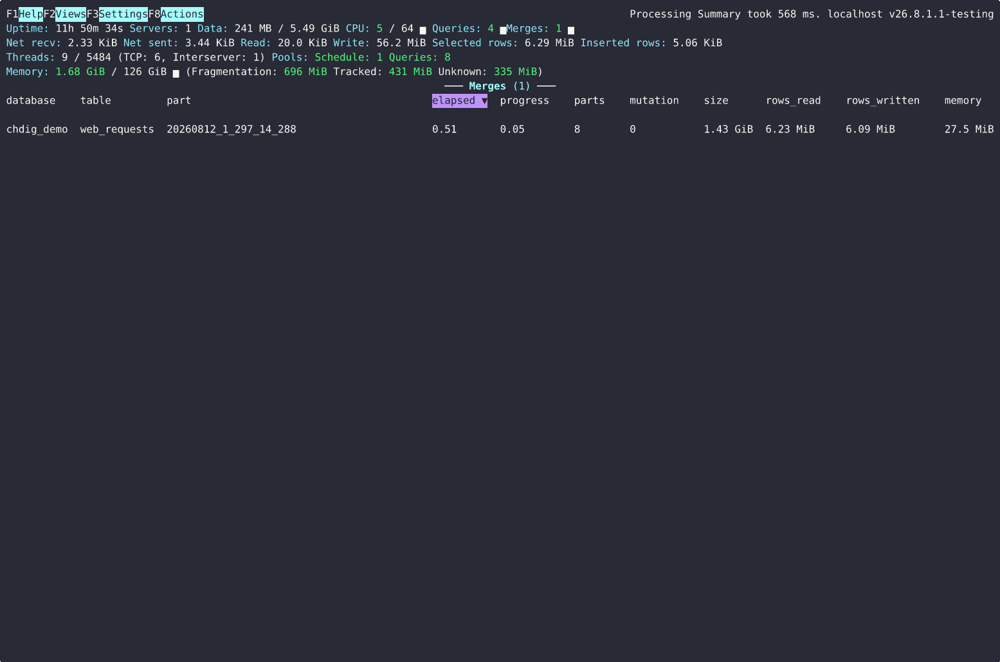

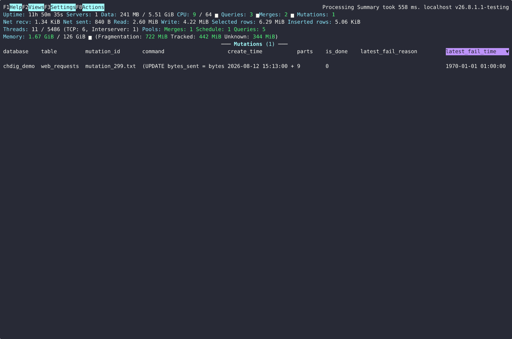

Part-level details: **Table Parts** (`system.parts`) and **Part Log**
(`system.part_log`, part lifecycle events - NewPart, MergeParts, ...):

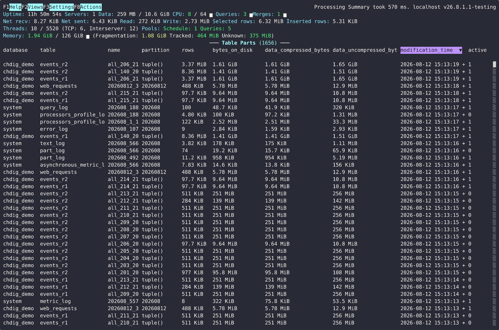

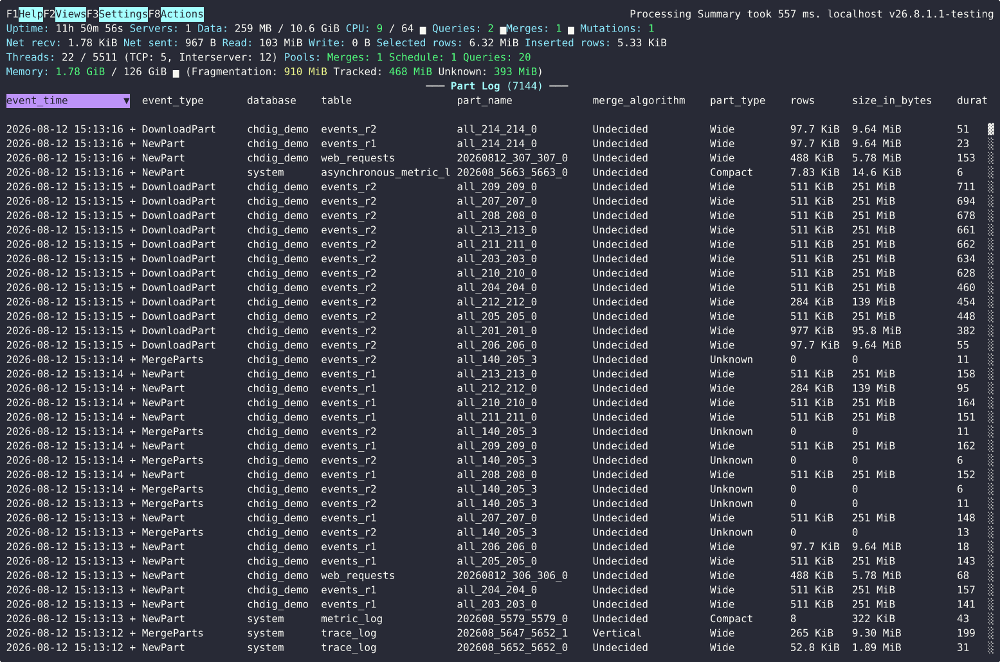

## Replication

**Replication queue** (`system.replication_queue`), **Replicated fetches**
(`system.replicated_fetches`) and **Replicas** (`system.replicas`) - note the
replication lag and queue size in the summary header:

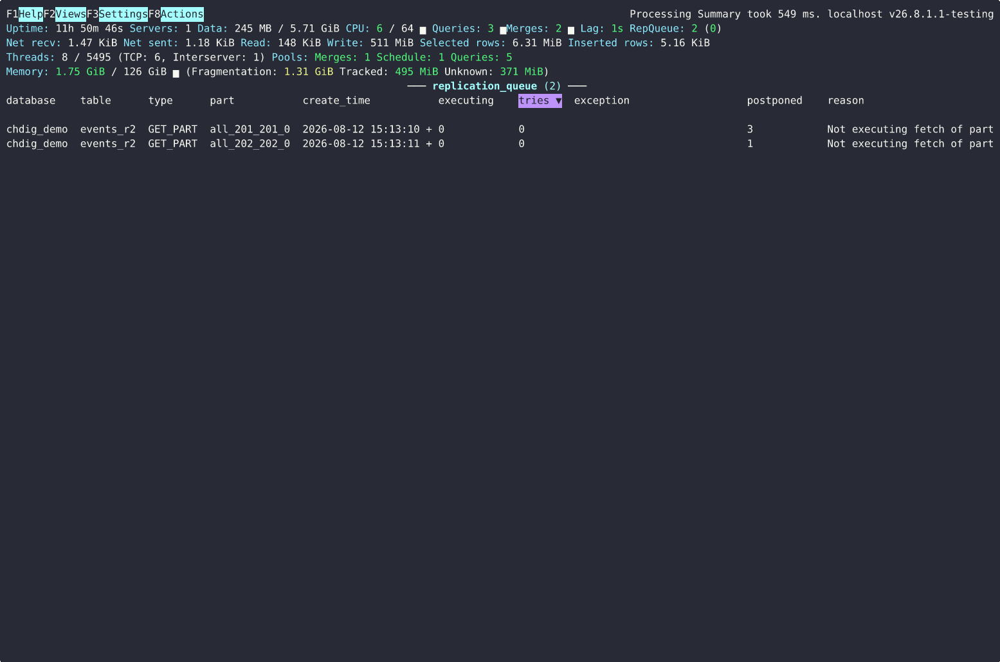

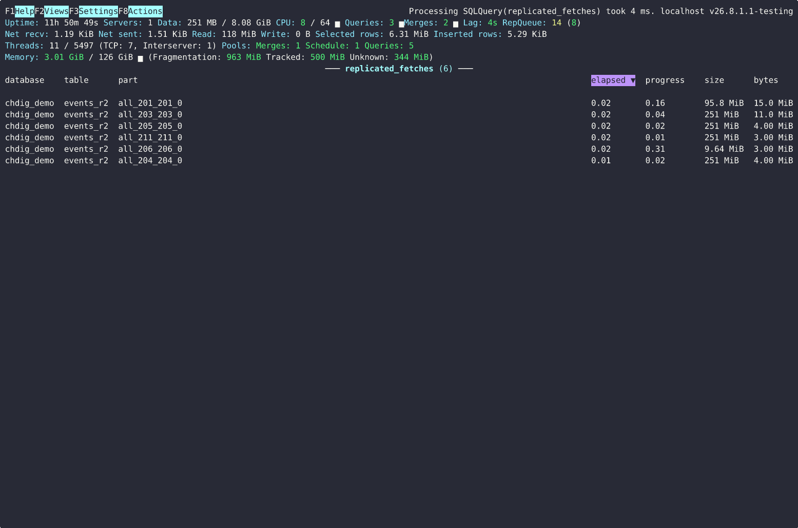

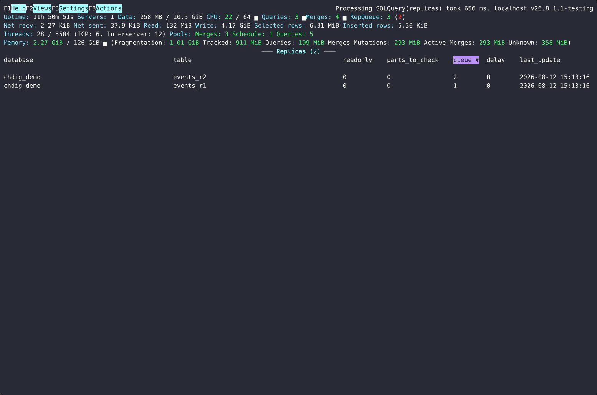

**ZooKeeper** browser (`system.zookeeper`, `chdig zookeeper`): **Enter** opens a
node (or shows its value and stats for a leaf), **Backspace**/**u** goes up.
**Enter** on a replica offers to open its `replica_path`/`zookeeper_path`
there (in the table's auxiliary ZooKeeper if it uses one, ClickHouse 25.6+).

## Tables

`system.tables` with sizes, parts and engine information:

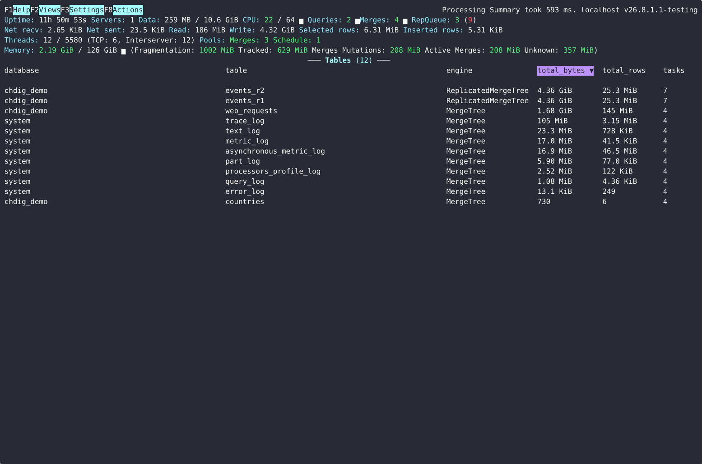

## Backups

`system.backups`:

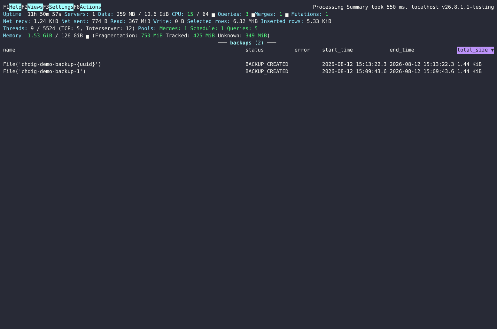

## Dictionaries

`system.dictionaries` - status, memory usage, hit rate:

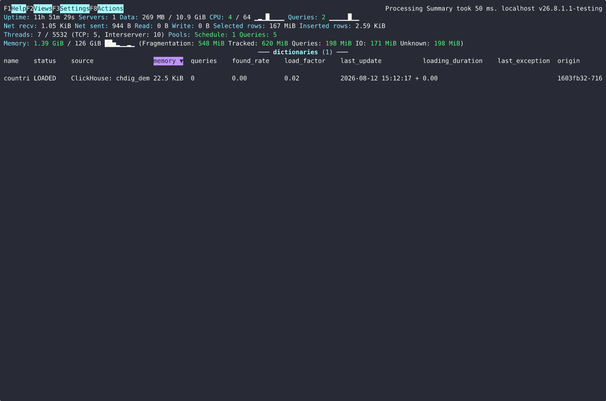

## Errors

Aggregated `system.errors` since server start (and **Error log** shows them
over time):

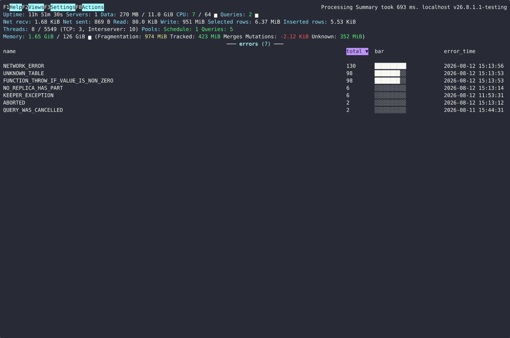

## Help

**F1** lists all shortcuts and the focused view's actions:

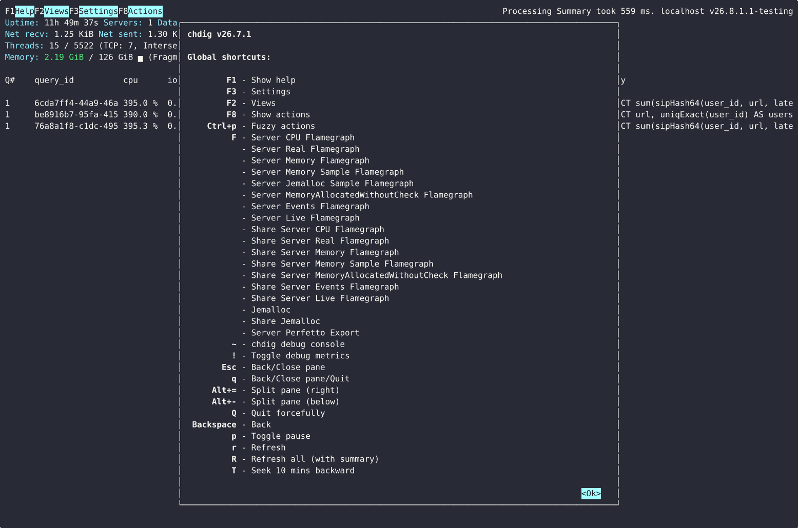

## And more

Also available (no screenshots): S3/Azure queues, asynchronous inserts,
background pool tasks (current and history), metric logs, loggers, and an
interactive SQL client (`chdig client`).
