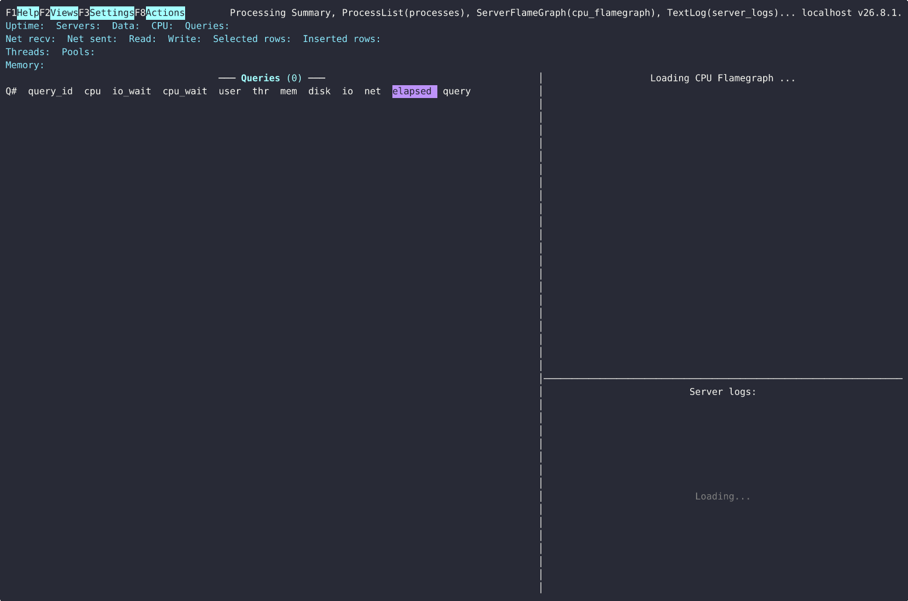

### chdig

Dig into [ClickHouse](https://github.com/ClickHouse/ClickHouse/) with TUI interface.

### Demo

[](https://asciinema.org/a/ZEKN312JmcADLtiS)

### Installation

`chdig` is also available as part of `clickhouse` - `clickhouse chdig`, but
that version may be slightly outdated.

Pre-built packages (`.deb`, `.rpm`, `archlinux`, `.tar.gz`) and standalone
binaries for `Linux` and `macOS` are available for both `x86_64` and `aarch64`
architectures.

The latest [unstable release can be found on GitHub](https://github.com/azat/chdig/releases/tag/latest).

*See also the complete list of [releases](https://github.com/azat/chdig/releases).*

<details>

<summary>Package repositories (AUR, Scoop, Homebrew)</summary>

#### archlinux user repository (aur)

And also for archlinux there is an aur package:
- [**chdig-latest-bin**](https://aur.archlinux.org/packages/chdig-latest-bin) - binary artifact of the upstream
- [chdig-git](https://aur.archlinux.org/packages/chdig-git) - build from sources
- [chdig-bin](https://aur.archlinux.org/packages/chdig-bin) - binary of the latest stable version

*Note: `chdig-latest-bin` is recommended because it is latest available version and you don't need toolchain to compile*

#### scoop (windows)

```
scoop bucket add extras
scoop install extras/chdig
```

#### brew (macos)

```
brew install chdig
```

</details>

### Motivation

The idea is came from everyday digging into various ClickHouse issues.

ClickHouse has a approximately universe of introspection tools, and it is easy
to forget some of them (see the [Know Your
ClickHouse](https://azat.sh/presentations/2022-know-your-clickhouse/)
presentation and the picture below).
But this requires you to dig into lots of places, and even though during this
process you will learn a lot, it does not solves the problem of forgetfulness.
So I came up with this simple TUI interface that tries to make this process
simpler.

<details>

<summary>Know Your ClickHouse</summary>

Here is a picture by analogy to what [Brendan
Gregg](https://www.brendangregg.com/linuxperf.html) did for Linux:

[](https://azat.sh/presentations/2022-know-your-clickhouse/Know-Your-ClickHouse.png)

*Note, the picture and the presentation had been made in the beginning of 2022,
so it may not include some new introspection tools*.

</details>

`chdig` can be used not only to debug some problems, but also just as a regular
introspection, like `top` for Linux.

### Features

- `top` like interface (or [`csysdig`](https://github.com/draios/sysdig) to be more precise)
- [Flamegraphs](Documentation/FAQ.md#what-is-flamegraph) (CPU/Real/Memory/Live) in TUI (thanks to [flamelens](https://github.com/ys-l/flamelens)), auto-refreshed while the query is running (with changes since the previous refresh highlighted; `P` pauses, `D` toggles the diff coloring)
- [Perfetto support](Documentation/FAQ.md#what-is-perfetto-export)
- Share flamegraphs (using [pastila.nl](https://pastila.nl/) and [speedscope](https://www.speedscope.app/))
- Share logs via [pastila.nl](https://pastila.nl/)
- Share query pipelines (using [viz.js](https://github.com/mdaines/viz-js) and [pastila.nl](https://pastila.nl/))
- Split panes (tmux-like) - multiple views side by side, with zoom
- [Views configuration](Documentation/FAQ.md#how-to-configure-views-and-panes-layout-like-tmuxinator) - startup pane layout and per-view filter/interval/limit (like `tmuxinator`)
- Cluster support (`--cluster`) - aggregate data from all hosts in the cluster
- Historical support (`--history`) - includes rotated `system.*_log_*` tables
- `clickhouse-client` compatibility (including `--connection`) for options and configuration files

See the [features tour with screenshots](Documentation/Features.md), and there
is a huge bunch of [ideas](https://github.com/azat/chdig/issues).

**Note, this it is in a pre-alpha stage, so everything can be changed (keyboard
shortcuts, views, color schema and of course features)**

### Requirements

If something does not work, like you have too old version of `ClickHouse`, consider upgrading.

*Note: the oldest version that had been tested was 21.2 (at some point in time)*

### Build from sources

```
cargo build
```

For development, debugging and build troubleshooting, see [Documentation/Developers.md](Documentation/Developers.md).

## References

- [Features tour (with screenshots)](Documentation/Features.md)
- [FAQ](Documentation/FAQ.md)
- [Bugs list](Documentation/Bugs.md)
- [Shortcuts](Documentation/Actions.md#shortcuts)
- [Developers](Documentation/Developers.md)
- [Know Your ClickHouse (presentation, 2022)](https://azat.sh/presentations/2022-know-your-clickhouse/)
